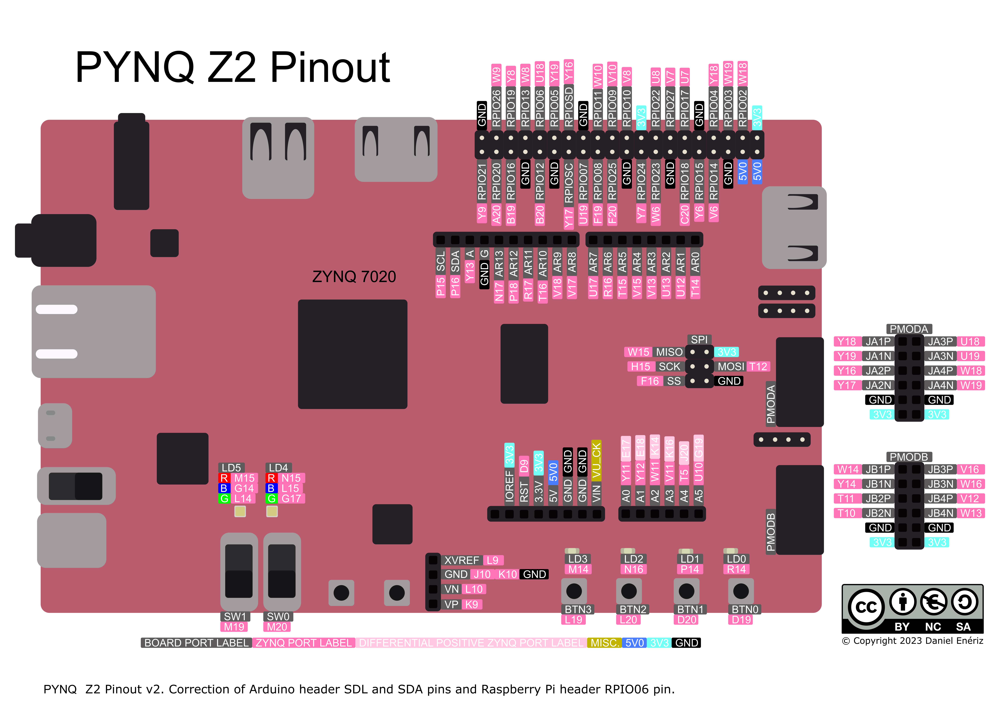

# Booting on FRISC-V

FRISC-V has the ability to load programs by itself using the zero-stage bootloader (ZSBL) stored in an on-chip ROM. Four boot modes are supported:

Mode   | Method          | Description
------ | --------------- | -----------
Mode 0 | Direct Jump     | Program loaded externally (via XSDB), just jump to program in memory.
Mode 1 | Xmodem          | Load program from a host machine via UART
Mode 2 | SD Card         | Load program from SD card inserted into the connection board. **This mode is not implemented yet.**
Mode 3 | Wait for `BTN0` | Wait for press of `BTN0`, then jump to externally loaded program.

## Selecting Boot Mode

The boot mode is selected by toggling the switches on the bottom edge of the PYNQ-Z2 (`SW0` and `SW1`). The mode must be selected before startup or reset.



The boot mode is encoded in binary by the switch positions, as shown in the table

Mode   | Encoding | `SW1` position | `SW0` position
------ | -------- | -------------- | --------------
Mode 0 | `00`     | `0` - Down     | `0` - Down
Mode 1 | `01`     | `0` - Down     | `1` - Up
Mode 2 | `10`     | `1` - Up       | `0` - Down
Mode 3 | `11`     | `1` - Up       | `1` - Up

## Boot Process

The zero-stage bootloader is the first program executed after a reset. Its purpose is loading the application program (often an embedded application or a bootloader of an OS) into main memory.

On successful startup, `[ZSBL] Ready` is printed to UART. Immediately after, the boot mode is read from the switches. The detected boot mode will be printed to UART without attempting a load/boot. The messages corresponding to each of the modes are shown in the table below:

Mode   | Message
------ | -------
Mode 0 | `[ZSBL] Mode: DRAM`
Mode 1 | `[ZSBL] Mode: UART`
Mode 2 | `[ZSBL] Mode: SD`
Mode 3 | `[ZSBL] Waiting for BTN0 press`

### Mode 0 - Direct Jump

This is the simplest boot mode. A program needs to be loaded into main memory using XSDB while FRISC-V is in reset (`LD5` showing red), then reset needs to be released with Mode 0 selected. The program must be loaded to the start of DRAM, at AXI address `0x0010_0000`, which corresponds to physical address `0x8000_0000`

Start with a programmed board in reset, then execute the following commands.

**Linux:**

```bash
make load
make run
```

**Windows:**

```powershell
.\build.ps1 -Target load
.\build.ps1 -Target run
```

The `load` targets load the program stored in `test/prog.bin` to address `0x8000_0000`. In Mode 0, execution starts immediately after the release of reset, without waiting for user input.

### Mode 1 - Xmodem

Mode 1 uses the standard Xmodem protocol to copy a file from the host machine into main memory. This is the preferred method as it is the fastest, and does not rely on the Xilinx suite (XSDB) or other external programs. Instead, standard Linux programs like `minicom`, or `sx` can be used. A Python script (`scripts/xmodem_load.py`) is also provided if the former programs are not available.

Linux (or WSL2) is recommended for this method, as interacting with serial devices is simpler. It is possible to do natively in Windows, but will not be covered here.

Start in a Linux shell with a serial connection open to the UART chip of the I/O board (see [UART.md](UART.md)), and a programmed board. Confirm `/dev/ttyUSB0` is present.

Select Mode 1 and start/reset FRISC-V. When `LD0` lights up green, the ZSBL is waiting for the host to start an Xmodem transfer. FRISC-V will retry 16 times over the course of about a minute. If a transfer was not started during that time, Mode 1 will be aborted and Mode 2 started. That will be indicated by the turning off of `LD0`.

Once `LD0` turns green, an Xmodem transfer should be started.

**Minicom:**

`minicom` needs to be installed. Install it by running `sudo apt install minicom -y`. `minicom` must be set to the correct serial port and baudrate, see [UART.md](UART.md).

Open minicom (run `minicom`), enter send mode (`CTRL+A S`) and select `xmodem`. Select the desired binary and confirm.

**Python:**

`pyserial` needs to be installed. Install it by running `pip install pyserial`.

Run the Python script.

```bash
python3 scripts/xmodem_load.py
```

By default, `prog.bin` will be sent to `/dev/ttyUSB0` at `115200` baud. Default behavior can be changed using the following command line arguments:

Argumen   | Alias | Default         | Example                                              | Description
--------- | ----- | --------------- | ---------------------------------------------------- | -----------
`--port`  | `-p`  | `/dev/ttyUSB0`  | `python3 scripts/xmodem_load.py --port /dev/ttyAMA0` | Change which serial port is used
`--baud`  | `-b`  | `115200`        | `python3 scripts/xmodem_load.py --b 9600`            | Change baudrate
`--bin`   | N/A   | `test/prog.bin` | `python3 scripts/xmodem_load.py --bin ./app.bin`     | Change loaded file by path
`--quiet` | `-q`  | `False`         | `python3 scripts/xmodem_load.py --quiet`             | Suppress progress output

Execution of the loaded program will start immediately after the Xmodem transfer completes, without user interaction.

### Mode 2 - SD Card

Load a program stored on an SD card inserted into the I/O board. Tries Mode 3 after failure.

> [!WARNING]
> Mode 2 is not implemented yet.

### Mode 3 - Wait for Button Press

Similar to Mode 0, expects a program to be externally loaded into main memory. Execution does not start immediately after release of reset, but after the user presses `BTN0`. There is no timeout for this boot mode.
