# `friscv_mem_if` Protocol Specification

Interface definition: [`rtl/friscv_mem_if.sv`](../rtl/friscv_mem_if.sv)  
Type definitions: [`rtl/friscv_pkg.sv`](../rtl/friscv_pkg.sv)

## Signal Table

| Signal       | Width | Direction  | Optional | Description                        |
|--------------|-------|------------|----------|------------------------------------|
| `rw`         | 2     | M → S      | No       | Transaction command (see encoding) |
| `addr`       | 32    | M → S      | No       | Byte address                       |
| `size`       | 3     | M → S      | No       | Transfer width (see encoding)      |
| `wdata`      | 32    | M → S      | No       | Write data                         |
| `rdata`      | 32    | S → M      | No       | Read data                          |
| `wait_req`   | 1     | S → M      | No       | Backpressure, stalls master        |
| `burst_en`   | 1     | M → S      | **Yes**  | Asserted for burst transactions    |
| `beat_valid` | 1     | S → M      | **Yes**  | Valid read beat during burst       |
| `err`        | 1     | S → M      | **Yes**  | Slave signals a transfer error     |
| `rstn`       | 1     | M → S      | No       | Adapter reset (active-low)         |

Optional signals that are not implemented must be tied to a constant:

- Master side: drive `burst_en = 0`
- Slave side: drive `beat_valid = 0`, `err = 0`

## Signal Encodings

### `rw` - `rw_cmd_e`

| Value   | Name       | Meaning           |
|---------|------------|-------------------|
| `2'b00` | `RW_IDLE`  | No transaction    |
| `2'b01` | `RW_WRITE` | Write transaction |
| `2'b10` | `RW_READ`  | Read transaction  |

### `size` - `mem_width_e` (matches RISC-V `funct3` load/store encoding)

| Value   | Name        | Transfer width        |
|---------|-------------|-----------------------|
| `3'b000`| `WIDTH_I8`  | Byte, sign-extend     |
| `3'b100`| `WIDTH_U8`  | Byte, zero-extend     |
| `3'b001`| `WIDTH_I16` | Halfword, sign-extend |
| `3'b101`| `WIDTH_U16` | Halfword, zero-extend |
| `3'b010`| `WIDTH_I32` | Word (32-bit)         |

Sign/zero-extend semantics apply to the slave when returning `rdata`.

## Basic Handshake

A transaction begins when the master drives `rw` to `RW_WRITE` or `RW_READ`. The transaction is **accepted** on the first rising clock edge where `wait_req` is low.

**Rules:**

- Master must hold `rw`, `addr`, `size`, and `wdata` (for writes) **stable** while `wait_req` is high.
- Slave drives `wait_req` high when it cannot accept a new transaction or is busy with a prior one. Slave `wait_req` logic must not be combinatorially dependent on `addr`, `wdata`, or `size` - doing so would create a combinatorial loop through any master core that generates those signals from `wait_req`.
- The slave samples all control signals (`rw`, `addr`, `size`, `wdata`, `burst_en`) on the **first rising edge where `rw != RW_IDLE`**. Any changes to these signals while `wait_req` is high are ignored.
- After acceptance, master may change or deassert `rw` on the next cycle.
- For reads, slave must present valid `rdata` on the first rising edge where `wait_req` is low after the initiating edge. The master must capture `rdata` on that same edge, the slave makes no guarantee that `rdata` is stable on any subsequent cycle.

### Single write, zero wait

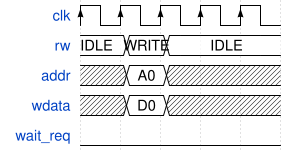

### Single write, backpressure

Master holds `rw`, `addr`, `wdata` stable while `wait_req=1`. Transaction accepted on the cycle `wait_req` falls.

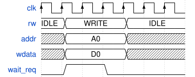

### Single read, zero wait

Master must capture `rdata` on the acceptance edge. No hold guarantee after that cycle.

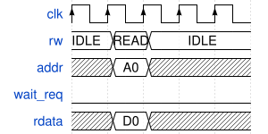

### Single read, backpressure

`rdata` is valid only on the first `wait_req`-low edge after the request.

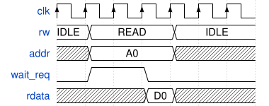

### Back-to-back reads

Master issues a new read on the same cycle the previous one completes. Each `rdata` is valid and must be captured on its respective acceptance edge.

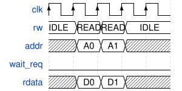

> [!NOTE]
> **Note for complex adapters (e.g. `friscv_axi4_full_adapter`):** `wait_req` is derived combinatorially from the next state, so it goes low one cycle before the adapter actually enters `S_IDLE`. A new request driven on the completion cycle is not latched until the following cycle - but because `wait_req` bounces back to 1 at that point, the master is forced to hold the request stable long enough for it to be captured. Back-to-back is therefore safe as long as the master respects the hold-while-`wait_req`-high rule.

## Burst Transactions (`burst_en` - optional)

`burst_en` signals to the slave that the transaction covers multiple beats. The burst length is agreed out-of-band (typically a design parameter of the master, e.g. cache line size).

### Burst write

- Master asserts `burst_en = 1` together with the first `rw = RW_WRITE`.
- Master must provide one new word on `wdata` **every cycle** for the entire burst, **no gaps are permitted**. The slave captures `wdata` on every posedge while the burst is in progress, regardless of content.
- `wait_req` asserts on the same cycle as the first `WRITE` (combinatorial from the slave) and stays high until the downstream bus completes the transfer, which may be many cycles after the last data word.

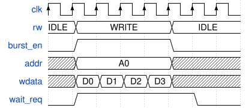

#### Illegal: burst write with a data gap

The slave captures whatever is on `wdata` each cycle, a gap silently corrupts the transfer with no error signal and no retry.

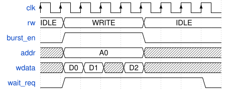

### Burst read

- Master asserts `burst_en = 1` together with `rw = RW_READ` and holds both stable while `wait_req` is high.
- Slave drives `beat_valid = 1` on each cycle that `rdata` holds a valid beat. Beats are **not** guaranteed to be consecutive, the slave may insert gaps.
- Master must capture `rdata` on **every** cycle where `beat_valid = 1` and ignore `rdata` on all other cycles.
- `wait_req` deasserts on the final beat.

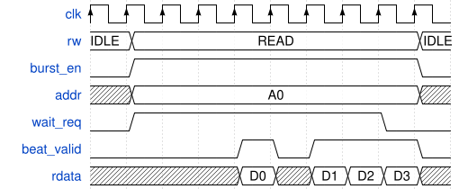

## Error Response (`err` - optional)

Slave drives `err = 1` on the completion cycle (same edge `wait_req` deasserts) to signal a fault (e.g. AXI SLVERR/DECERR). `rdata` is undefined when `err = 1`. For burst transfers, `err` may assert on any beat; behaviour after an error beat is implementation-defined.

Slaves that never generate errors must tie `err = 0`.

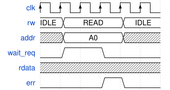

## Adapter Reset (`rstn`)

`rstn` is an **active-low** reset driven by the master to the slave, separate from the core's own system reset to allow independent adapter reset timing.

**Motivation:** A complex adapter connected to an external bus (e.g. `friscv_axi4_full_adapter`) may have an in-flight transaction that cannot be safely aborted mid-transfer. The master drives `rstn` low only after the transfer completes, preventing the external bus from being left in an undefined state.

**Rules:**

- Adapter resets all internal state on the first rising edge where `rstn = 0`.
- Master must not assert `rstn` while a transfer is in progress unless the adapter can safely abort.
- For simple adapters with no in-flight state (e.g. single-cycle SRAM wrappers), `rstn` may be connected directly to the system reset.

### `rstn` during idle (safe)

No transaction in progress when `rstn` is asserted. Adapter resets on the first posedge with `rstn = 0`.

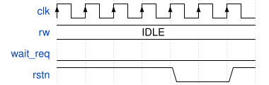

### `rstn` deferred until transfer complete

Master holds `rstn = 1` while `wait_req = 1`. After the transaction completes and `rdata` is captured, master asserts `rstn = 0` on the next cycle. This is the pattern used by `friscv_axi4_full_adapter`.

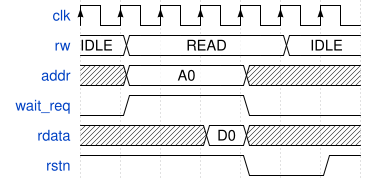

## Simple Adapter Checklist

| Feature      | If not implemented                      |
|--------------|-----------------------------------------|
| `burst_en`   | Master drives `0`; slave ignores input  |
| `beat_valid` | Slave drives `0`                        |
| `err`        | Slave drives `0`                        |
| `rstn`       | Connect directly to system reset        |

## Waveform Sources

WaveDrom JSON sources are in [`docs/assets/wavedrom_src/`](assets/wavedrom_src/).  
SVGs were generated with [`wavedrom-cli`](https://github.com/wavedrom/cli) and are in [`docs/assets/images/mem_if/`](assets/images/mem_if/).

To regenerate:

```sh
# from repo root (requires wavedrom-cli on PATH)
for f in docs/assets/wavedrom_src/mem_if_*.json; do
  wavedrom-cli -i "$f" -s "docs/assets/images/mem_if/$(basename "$f" .json).svg"
done
```
