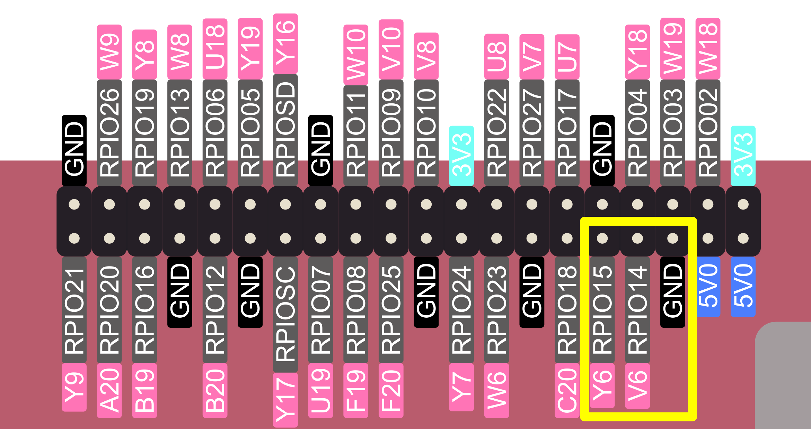
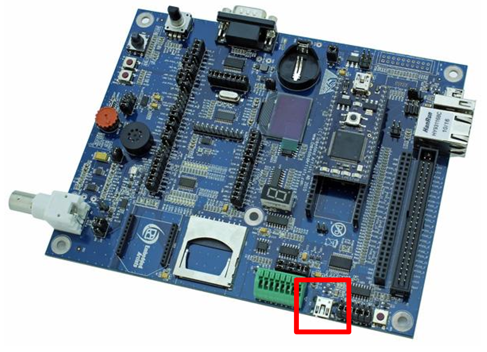
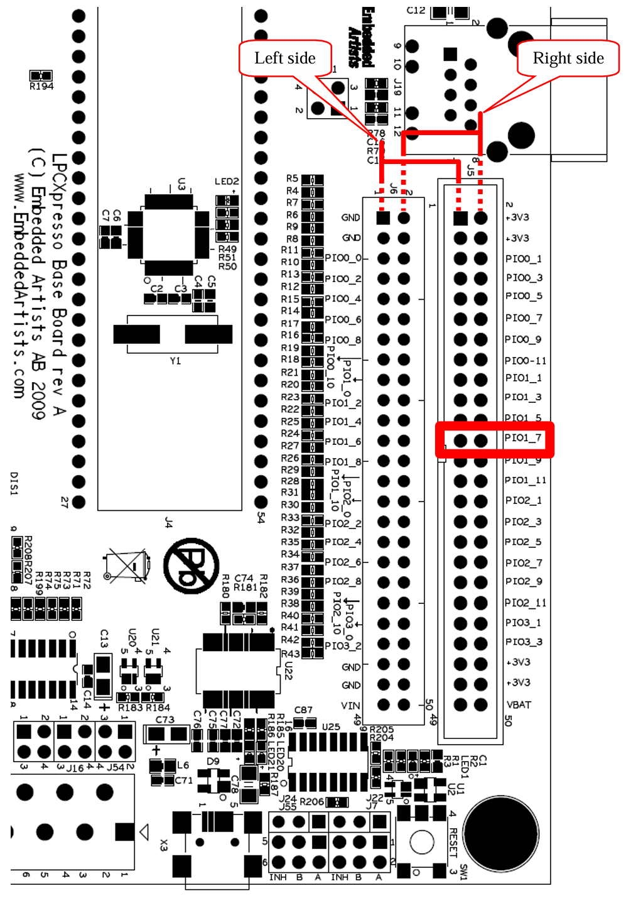

# Connecting to FRISC-V via Serial

FRISC-V has a hardware UART interface connected to the Raspberry Pi header in the standard pinout (pins 8 and 10). Hardware support is provided by a Xilinx AXI UART 16550 module. The baud rate is configured in software via a divisor register; the default divisor of `49` yields `115200` baud with the ~90.9 MHz AXI clock.



## Pinouts and Addresses

### FRISC-V Side

**Standard Pinout:**

Pin No. | Board Port Label | ZYNQ Port Label | Function
------- | ---------------- | --------------- | --------
6       | `GND`            | N/A             | Ground
8       | `RPIO14`         | `V6`            | UART Transmit
10      | `RPIO15`         | `Y6`            | UART Receive

**Address Map:**

The base address of hardware UART is `0x4060_0000`. Each NS16550 register occupies one 32-bit word (only the low 8 bits are used). The address space spans `0x4060_0000`–`0x4060_FFFF`.

Offset  | Register              | Description
------- | --------------------- | -----------
`0x00`  | `RBR` / `THR` / `DLL` | Receive Buffer (read) / Transmit Holding (write) / Divisor Latch Low (when `LCR[7]`=1)
`0x04`  | `IER` / `DLM`         | Interrupt Enable / Divisor Latch High (when `LCR[7]`=1)
`0x08`  | `IIR` / `FCR`         | Interrupt Identification (read) / FIFO Control (write)
`0x0C`  | `LCR`                 | Line Control
`0x10`  | `MCR`                 | Modem Control
`0x14`  | `LSR`                 | Line Status
`0x18`  | `MSR`                 | Modem Status
`0x1C`  | `SCR`                 | Scratch

**Register Bit Map:**

Read from `RBR` to receive a byte; write to `THR` to transmit a byte. Access the divisor latches (`DLL`/`DLM`) by setting `LCR[7]` (DLAB) to `1` first.

`LCR` (Line Control Register):

Bit(s) | Name   | Description
------ | ------ | -----------
`1:0`  | `WLS`  | Word length: `0x3` = 8-bit
`2`    | `STB`  | Stop bits: `0` = 1 stop bit
`5:3`  | `PEN`  | Parity: `0` = none
`7`    | `DLAB` | Divisor Latch Access Bit – set to `1` to access `DLL`/`DLM`

`FCR` (FIFO Control Register, write-only):

Bit(s) | Name     | Description
------ | -------- | -----------
`0`    | `FEN`    | FIFO enable
`1`    | `RFIFOR` | Receiver FIFO reset
`2`    | `XFIFOR` | Transmitter FIFO reset
`7:6`  | `RXTRIG` | Receiver trigger level

`LSR` (Line Status Register):

Bit | Name   | Description
--- | ------ | -----------
`0` | `DR`   | Data Ready – received byte available in `RBR`
`5` | `THRE` | Transmitter Holding Register Empty – safe to write `THR`
`6` | `TEMT` | Transmitter Empty – all bytes have been shifted out

`IER` (Interrupt Enable Register):

Bit | Name    | Description
--- | ------- | -----------
`0` | `ERBFI` | Enable Received Data Available interrupt
`1` | `ETBEI` | Enable Transmitter Holding Register Empty interrupt
`2` | `ELSI`  | Enable Receiver Line Status interrupt
`3` | `EDSSI` | Enable Modem Status interrupt

**Baud Rate Configuration:**

The baud rate is set by writing a 16-bit divisor to `DLL` (low byte) and `DLM` (high byte) while `LCR[7]` (DLAB) is `1`:

$$\text{Divisor} = \frac{f_{\text{clk}}}{16 \times \text{Baud Rate}}$$

With the AXI clock of ~90.909 MHz, the divisor for 115200 baud is `49`.

### I/O Board Side

FRISC-V has first party support for the Embedded Artists LPCXpresso Base Board (I/O board).

The I/O board features a USB-to-UART bridge connected to the primary power source interface on the right side of the board (`U22`, `X3`). Default jumper positions should be used. Consult the LPCXpresso Base Board 
Rev B User’s Guide if needed.



The UART TX and RX pins are directly connected to the 50-pin expansion headers on the top side of the board.

Connection to the PYNQ-Z2 board should be done as follows:

Pin  | PYNQ (Connection Board) Name | I/O Pin Name | I/O Board Marking
---- | ---------------------------- | ------------ | -----------------
`RX` | `GPIO15/RXD0`                | `GPIO_6-RXD` | `PIO1.6`
`TX` | `GPIO14/TXD0`                | `GPIO_5-TXD` | `PIO1.7`

> [!IMPORTANT]
> If connecting without the connection board, grounds of the I/O board and PYNQ-Z2 should also be connected.



## Host Machine Connection

The recommended way of connecting to the USB-to-UART bridge on the I/O board is through `screen` on Linux. With a USB connected to the port shown in [I/O Board Side](#io-board-side) and detected as `/dev/ttyUSB0`, a serial connection can be connected by running:

```bash
sudo screen /dev/ttyUSB0 115200
```

`/dev/ttyUSB0` is the most common port. If the board was detected as a different port, its device path should be used. `115200` is the default baudrate used by FRISC-V. If FRISC-V is configured with a different baudrate, use that instead.

Install screen by running `sudo apt install screen -y` in a Linux terminal.

Connecting from Windows should be done through WSL2. As WSL does not have direct access to the devices connected to the Windows machine, the port must first be attached to WSL.

**Windows First-time Setup:**

In PowerShell, run:

```powershell
usbipd list
```

Connected USB devices will be listed, as shown below.

```powershell
PS C:\WINDOWS\system32> usbipd list
Connected:
BUSID  VID:PID    DEVICE                             STATE
2-1    0403:6001  USB Serial Converter               Not Shared
2-3    8087:0032  Intel(R) Wireless Bluetooth(R)     Not shared

Persisted:
GUID                                  DEVICE
be100f34-5425-4bd9-801c-0f2b1ce19841  USB-SERIAL CH340 (COM3)
```

Look for `USB Serial Converter` and note its `BUSID` (`2-1` in this case).

Bind the device with that `BUSID` for future use by running:

```powershell
usbipd bind --busid 2-1
```

If your `BUSID` was not `2-1`, use that `BUSID` instead.

**Connecting from Windows:**

The steps above need to be run only once. These steps need to be followed every time the I/O board is connected. If UART starts misbehaving or becomes unresponsive, reconnect the USB cable and start from here.

Attach the USB device to WSL using PowerShell to make it detectable as `/dev/ttyUSB0`.

```powershell
usbipd attach --wsl --busid 2-1
```

Again, use the `BUSID` your `usbipd list` detected, not necessarily `2-1`.

After that, enter WSL and run the connection command:

```bash
sudo screen /dev/ttyUSB0 115200
```

## Software Examples

Before using UART, the baud rate divisor and line parameters must be configured. The divisor is written while the Divisor Latch Access Bit (`LCR[7]`, DLAB) is set.

```c
// Initialize UART 16550 at UART_BASE
// divisor: baud rate = clk / (16 * divisor)
// For 115200 baud @ ~90.909 MHz: divisor = 49
void uart_init(uint8_t divisor) {
    UART_IER = 0;           // Disable all interrupts

    UART_LCR = 0x80;        // Set DLAB=1 to access divisor latches
    UART_DLL = divisor;     // Divisor low byte
    UART_DLM = 0;           // Divisor high byte

    UART_LCR = 0x03;        // 8N1, DLAB=0
    UART_FCR = 0x07;        // Enable FIFOs, reset RX and TX, 1-byte trigger
    UART_MCR = 0;           // No modem control
}
```

When writing a byte, software must wait until the Transmitter Holding Register is empty (`LSR[5]`, THRE).

```c
void uart_putc(char c) {
    // Wait until TX holding register is empty
    while (!(UART_LSR & UART_LSR_THRE));
    UART_THR = c;
}
```

When reading a byte, software must wait for the Data Ready flag (`LSR[0]`, DR).

```c
char uart_getc() {
    // Wait until received data is ready
    while (!(UART_LSR & UART_LSR_DR));
    return UART_RBR & 0xFF;
}
```

The constant values are defined as in [Pinouts and Addresses](#pinouts-and-addresses).

```c
#include <stdint.h>

// AXI UART 16550 register definitions
// Each register occupies one 32-bit word, only the low 8 bits are used.
#define UART_BASE  0x40600000

#define UART_RBR  (*(volatile uint8_t *)(UART_BASE + 0x00))  // Receive Buffer (read)
#define UART_THR  (*(volatile uint8_t *)(UART_BASE + 0x00))  // Transmit Holding (write)
#define UART_DLL  (*(volatile uint8_t *)(UART_BASE + 0x00))  // Divisor Latch Low  (DLAB=1)
#define UART_IER  (*(volatile uint8_t *)(UART_BASE + 0x04))  // Interrupt Enable
#define UART_DLM  (*(volatile uint8_t *)(UART_BASE + 0x04))  // Divisor Latch High (DLAB=1)
#define UART_FCR  (*(volatile uint8_t *)(UART_BASE + 0x08))  // FIFO Control (write)
#define UART_LCR  (*(volatile uint8_t *)(UART_BASE + 0x0C))  // Line Control
#define UART_MCR  (*(volatile uint8_t *)(UART_BASE + 0x10))  // Modem Control
#define UART_LSR  (*(volatile uint8_t *)(UART_BASE + 0x14))  // Line Status
#define UART_MSR  (*(volatile uint8_t *)(UART_BASE + 0x18))  // Modem Status
#define UART_SCR  (*(volatile uint8_t *)(UART_BASE + 0x1C))  // Scratch

// LSR bits
#define UART_LSR_DR    0x01  // Data Ready
#define UART_LSR_THRE  0x20  // Transmitter Holding Register Empty
#define UART_LSR_TEMT  0x40  // Transmitter Empty
```
